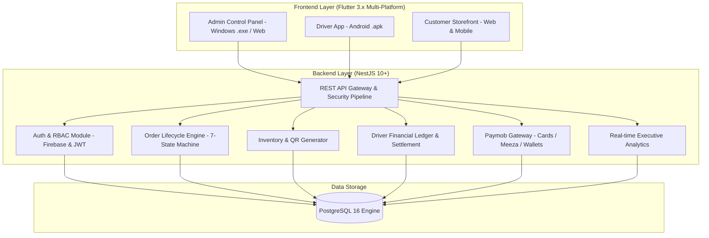

# 🚀 Antigravity Logistics, Shipping, and E-Commerce Platform

Enterprise-grade, scalable, and secure Logistics Management & E-Commerce System built with **NestJS**, **TypeORM**, **PostgreSQL**, and **Flutter Cross-Platform**.

---

## 🏛️ System Architecture



---

## 📦 Project Structure

```
logistics-ecommerce-platform/
├── backend/
│   ├── src/
│   │   ├── config/ (configuration.ts, typeorm.config.ts)
│   │   ├── common/ (enums, guards, decorators, filters, interceptors)
│   │   ├── database/ (entities, schema.sql, seeds/initial-seed.ts)
│   │   ├── modules/
│   │   │   ├── auth/ (JWT & Firebase Google Sign-In)
│   │   │   ├── users/ (Driver management & performance stats)
│   │   │   ├── products/ (Inventory control & QR code generator)
│   │   │   ├── orders/ (Strict state machine & Waybill generator)
│   │   │   ├── driver-ledger/ (COD double-entry cash ledger & settlements)
│   │   │   ├── payments/ (Paymob Egypt: Cards, Meeza, Vodafone Cash, HMAC verification)
│   │   │   ├── notifications/ (Firebase Cloud Messaging service)
│   │   │   └── analytics/ (Real-time executive KPI metrics)
│   │   ├── app.module.ts
│   │   └── main.ts
│   ├── Dockerfile
│   ├── docker-compose.yml
│   └── package.json
└── frontend/ (Prepared for Phases 4-7)
    └── pubspec.yaml
```

---

## ⚙️ Core Modules & Capabilities

### 1. Order Lifecycle Engine & State Machine
Enforces strict lifecycle state transitions without illegal jumps:
- `Pending` ➔ `In_Warehouse`, `Canceled`
- `In_Warehouse` ➔ `Dispatched_to_Driver`, `Canceled`
- `Dispatched_to_Driver` ➔ `Delivered`, `Postponed`, `Returned`, `In_Warehouse`
- `Postponed` ➔ `Dispatched_to_Driver`, `In_Warehouse`, `Canceled`, `Returned`
- `Delivered` ➔ (Terminal / `Returned` by admin)

### 2. Driver Financial Ledger & COD Reconciliation
- **Cash Collected**: Automatically debited to Driver's balance upon marking COD orders as `Delivered`.
- **Commission Earned**: Automatically calculated and credited based on driver commission rate.
- **Settlement Payouts**: Admin endpoint to accept collected physical cash and balance ledger records.

### 3. Paymob Egypt Payment Gateway
- Supports Credit/Debit Cards, Meeza Cards, and Egyptian Mobile Wallets (Vodafone Cash, Orange, InstaPay).
- Real-time Webhook listener with SHA-512 HMAC verification against `PAYMOB_HMAC_SECRET`.

---

## 🏃 Quickstart (Backend)

```bash
# 1. Navigate to backend directory
cd backend

# 2. Install dependencies
npm install

# 3. Configure environment
cp .env.example .env

# 4. Start PostgreSQL container
docker-compose up -d postgres

# 5. Run Database Seeding
npm run seed

# 6. Start NestJS Backend
npm run start:dev
```

- API Base URL: `http://localhost:3000/api/v1`
- Interactive Swagger Docs: `http://localhost:3000/api/docs`
